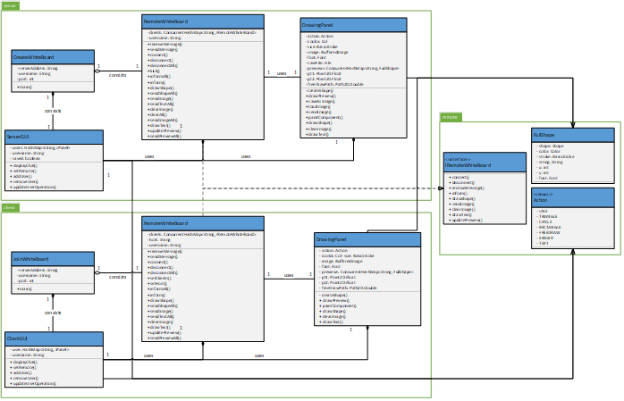
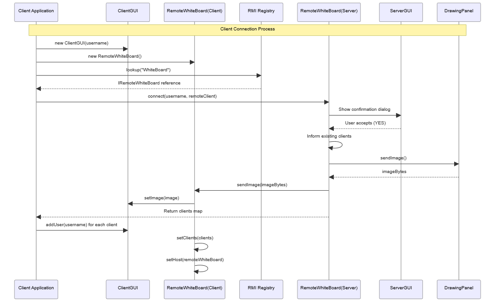
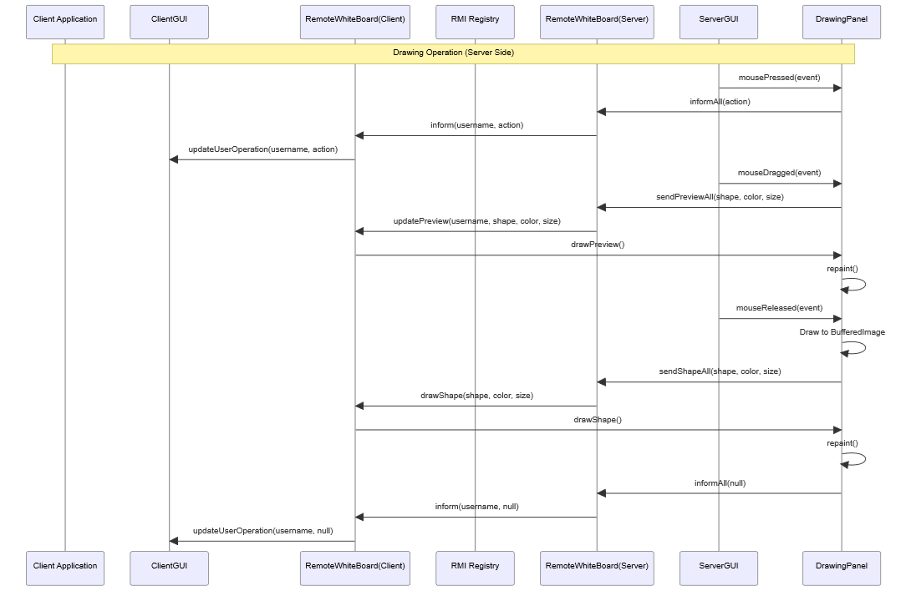

# CollabCanvas

**Java · Real-Time Collaborative Drawing · Networking · Concurrency**

## Overview

CollabCanvas is a **real-time collaborative drawing system** that allows multiple users to interact with the same whiteboard over a network. All connected clients maintain a consistent view of the canvas, with drawing updates propagated in near real time.

The project focuses on **concurrency management**, **state synchronization**, and **network communication** in a collaborative application, similar in spirit to online whiteboarding and co-editing tools.

---

## Problem Statement

Building a collaboration canvas involves several non-trivial challenges:

- Handling **simultaneous actions** from multiple users
- Keeping all clients **synchronized** with the same canvas state
- Managing **user sessions and permissions**
- Designing an efficient **message exchange protocol**
- Maintaining responsiveness under concurrent updates

This project addresses these challenges using a distributed system design implemented in Java.

---

## Features

- Real-time collaborative canvas shared across multiple users
- Concurrent editing with consistent global canvas state
- Thread-safe handling of drawing operations and shared data
- Event-based propagation of drawing updates to connected clients
- Support for drawing primitives:
    - Freehand drawing and erasing
    - Lines, rectangles, circles, and triangles
    - Text input at arbitrary positions

- User-selectable drawing colors (minimum of 16 supported)
- User session management with join/leave support and active user list
- Manager role with elevated privileges:
    - Approve or reject join requests
    - Remove connected users
    - Control canvas lifecycle (new, open, save, close)

- Optional text-based chat between users
- Graceful handling of disconnects and session termination

---

## User Workflow

1. The first user creates a collaboration session and becomes the **manager**
2. Other users request to join using the server address and port
3. The manager approves or rejects join requests
4. Approved users collaborate on the same canvas in real time
5. Users may leave at any time; the manager can remove users
6. When the manager exits, the session ends and all users are notified

---

## Architecture





---

## Requirements

### Runtime

- **Java:** JDK 8 or later (tested with Java 11)
- **Swing / AWT** – graphical user interface and canvas rendering
- **org.json** – JSON message construction and parsing
- **Google Gson** – object serialization and deserialization

All other dependencies use the Java standard library.

---

## How to Run

### Start the Collaboration Session (Manager)

The first user creates a new canvas session and becomes the manager.

```bash
java CreateWhiteBoard <server-address> <server-port> <username>
```

---

### Join an Existing Session

Other users can request to join the active canvas.

```bash
java JoinWhiteBoard <server-address> <server-port> <username>
```

---

## Tech Stack

- **Java** JDK 8+ (tested with Java 11)
- Java TCP sockets (`java.net`)
- Java threads
- `java.util.concurrent.locks` for synchronized access to shared state
- **org.json** (`JSONObject`, `JSONArray`) for structured message handling
- **Google Gson** for object serialization and deserialization
- **Swing** (`javax.swing`)
- **Java AWT / Java2D** (`java.awt`) for canvas rendering and interaction
